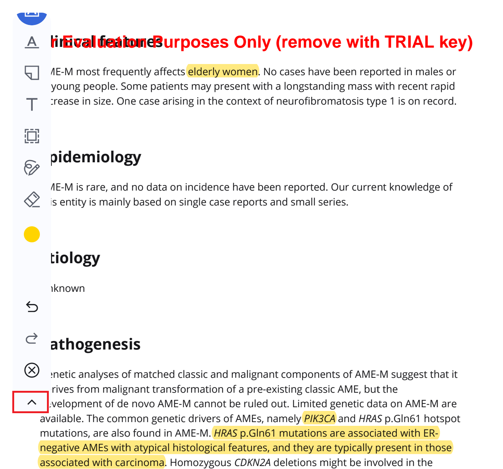
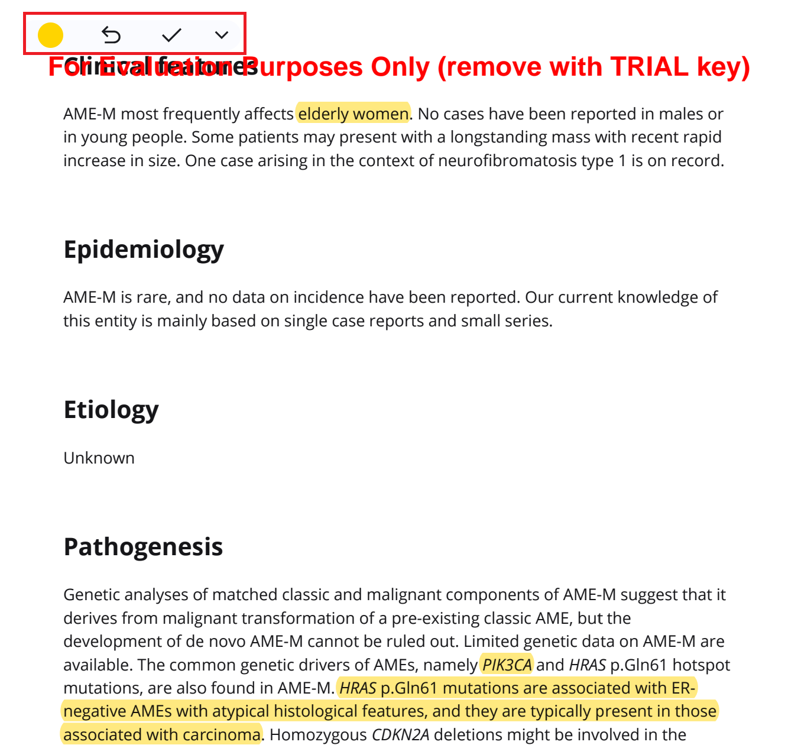

# Zotero + Annotation Toolbar Minimize/Expand Feature

This is a fork of [zotero/zotero-android](https://github.com/zotero/zotero-android) that adds a minimize/expand feature to the annotation toolbar in the PDF and HTML/EPUB readers. The toolbar can be collapsed to a compact stub at the docked edge, saving screen space while keeping annotation tools accessible. The stub includes a toggle button to enable/disable the selected tool without expanding the full toolbar.

## Screenshots

### Full Toolbar
The minimize button (▲) appears above the drag handle when the toolbar is expanded.

### Minimized Stub
When minimized, the toolbar collapses to a small stub. With a tool selected, it shows the color circle, undo button, toggle button (✓/✕), and expand button.

## Acknowledgements
- vibecoded with Qwen3.6 27B
